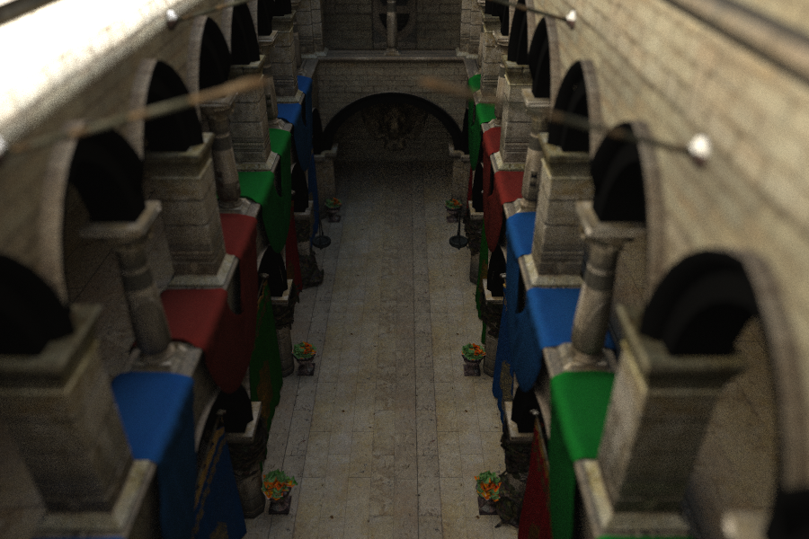
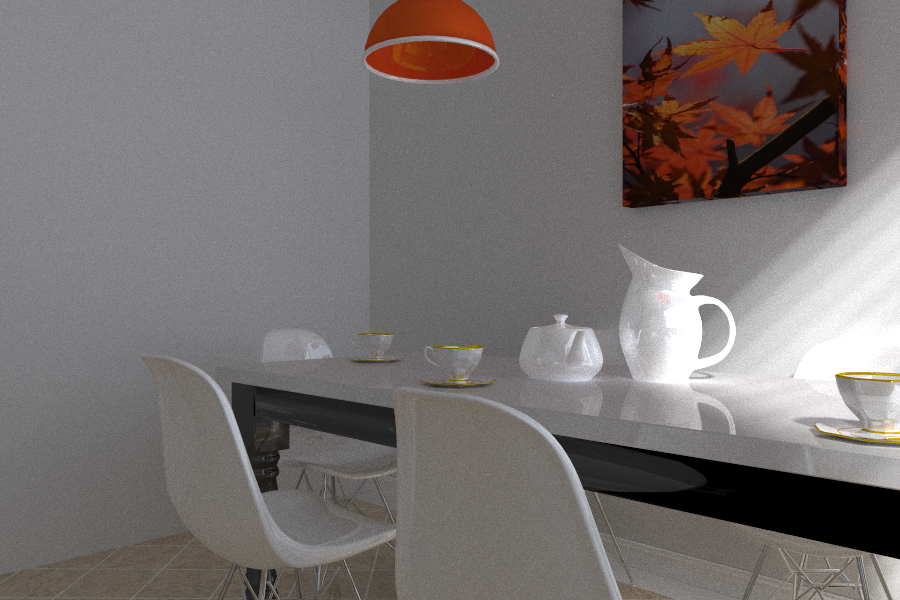
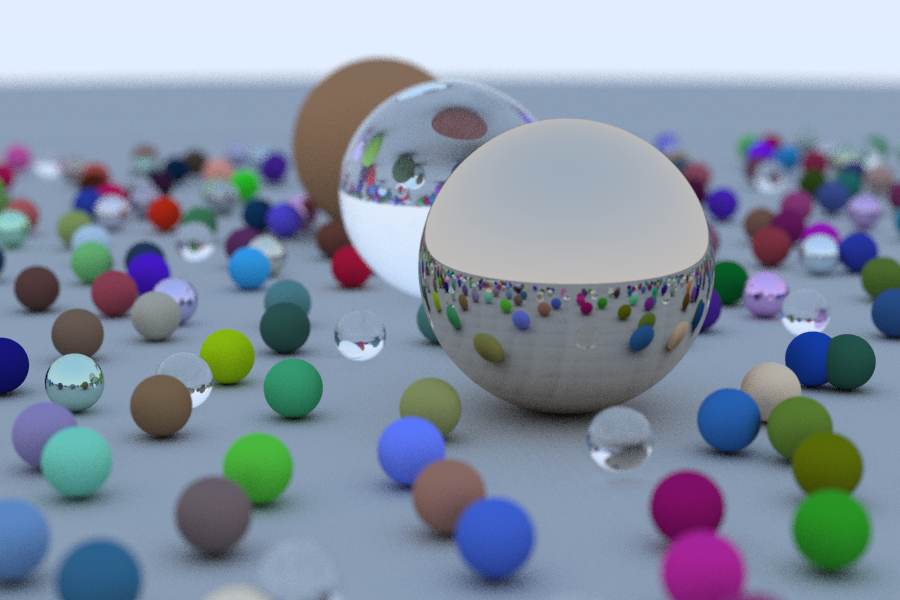
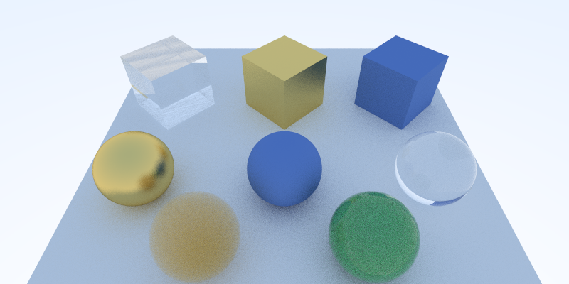
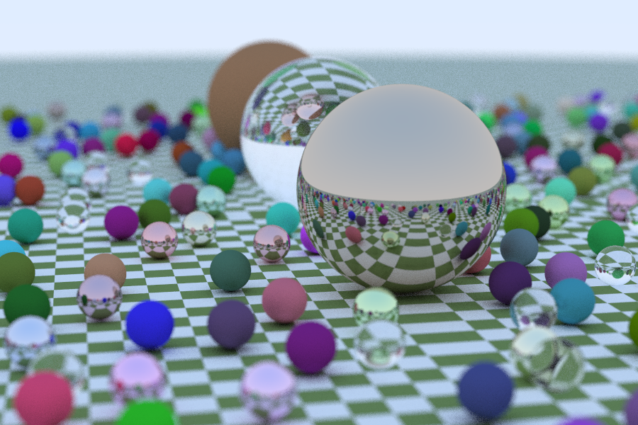
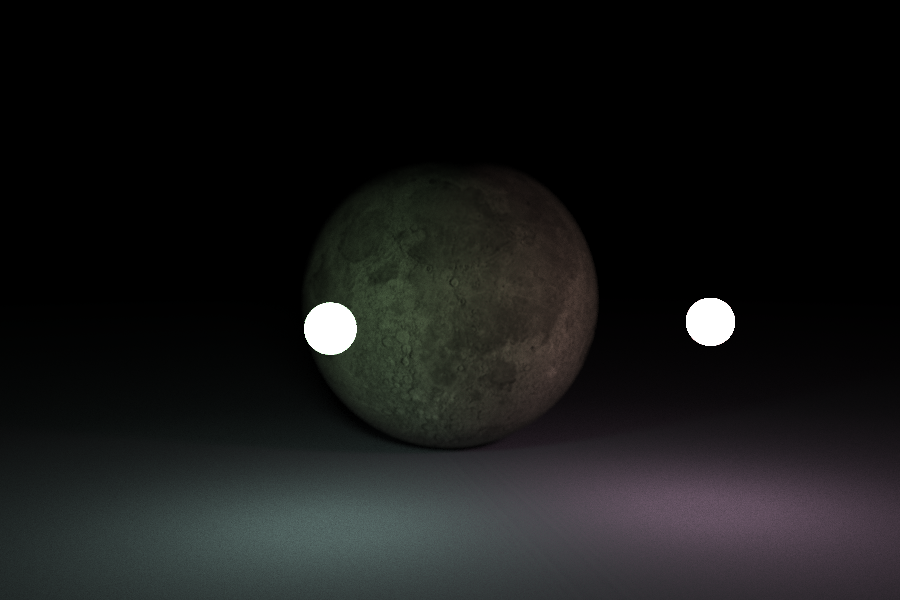
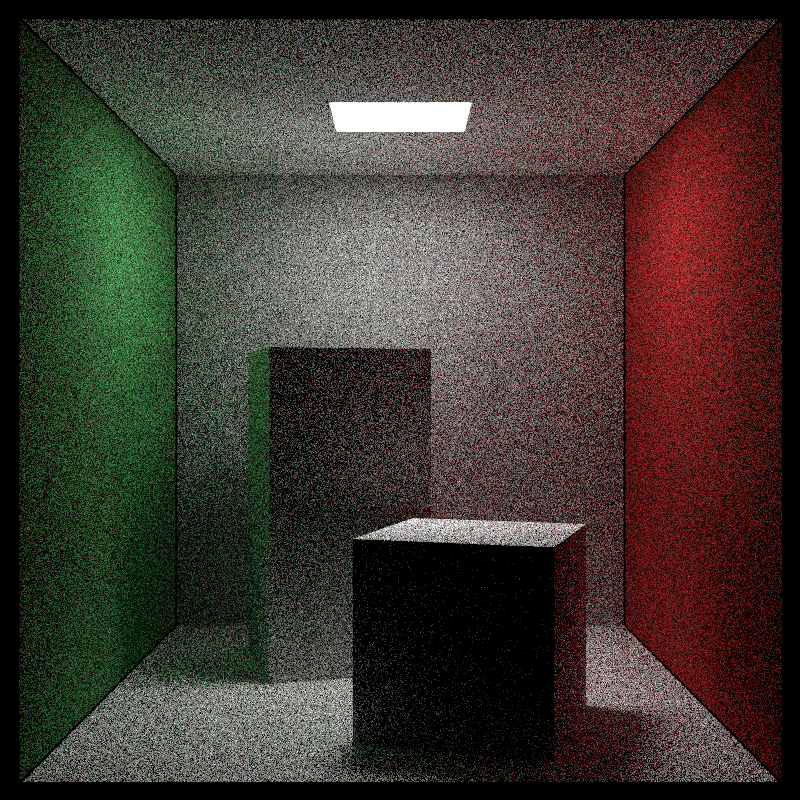
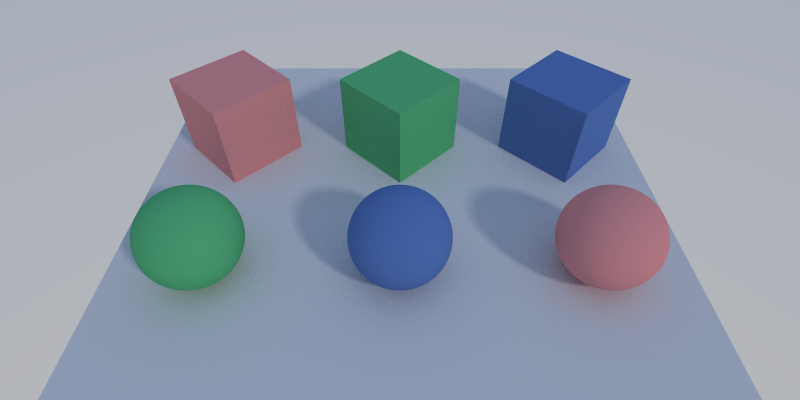

# FeiRays
Reusable Vulkan based ray-tracing code base.

The code is evolved from [VkRayTraceWeekend](https://github.com/fynv/VkRayTraceWeekend).

Here, I'm trying to make it more extendable and reusable, so I can have more fun with it.

Now playing with [McGuire Computer Graphics Archive](https://casual-effects.com/data/)



The "sponza" model, 900x600x1000 rays, rendered in 20.0 seconds using RTX 2060 super.



The "breakfast_room" model, 900x600x1000 rays, rendered in 20.2 seconds using RTX 2060 super.

Using the newly added Python frontend, the above case can be rendered using the following Python script:

```python
import FeiRays

scene = FeiRays.Scene(900, 600)
scene.add_sunlight((1,1,1), 2, (4000,4000,4000))

transform = FeiRays.Transform()
scene.add_wavefront_object(transform, "breakfast_room", "breakfast_room.obj")
scene.set_camera((2.5,1.5,2.5), (0,1.5,0), (0,1,0), 45)
scene.trace(1000, 50)

img = scene.get_image()
img.save("breakfast_room.png")
```
The model file "breakfast_room.obj" is located in the folder "breakfast_room".

## Building and Running

Building the project is simple. 

The only dependency you need is CUDA SDK, which is used for initializing the random number generator(RNG) states for each pixel.

[Volk](https://github.com/zeux/volk.git) and [Vulkan-Headers](https://github.com/KhronosGroup/Vulkan-Headers.git) are included as submodules,
so it should be fine to build without Vulkan SDK, and the resulted executables should be adaptive to different Vulkan versions. 
But be sure to have the latest graphics driver installed, one that supports Vulkan. 

* Clone the repo and update the submodules
* Use CMake to generate a VS solution at FeiRays/build (Linux build not tested yet).
* Build and run the tests. 
* Shaders (spv) are expected at ../shaders relative to the starting folder.

## License 

I've decided to license this project under ['"Anti 996" License'](https://github.com/996icu/996.ICU/blob/master/LICENSE)

Basically, you can use the code any way you like unless you are working for a 996 company.

[](https://996.icu)


## Progress

In case someone is interested in the progress of the project, here is a list of what have been implemented so far.


### Random Number Generator for Shaders

RNGState.h, rand_state_init.cu, shaders/rand.shinc

For monte carlo path-tracing, it is quite essential to have a pseudo-random number generator ready everywhere.
For this purpose, we have a minimal set of XORWOW implementation of CURAND ported here. 
While the initialization of the RNG states are done by CUDA, the recursive random number generation can happen in shaders. 

While the quality of the random number generated from XORWOW is good, the method has the following downsides:

* Initialization is expensive: if the scene is simple, the initialization can cost most of the time
* The size of each RNG state is 6x32bit, which is quite big.

This module can be replaced relatively easily, once we know there is a better method for this purpose.

### Vulkan Based Path-Tracing framework

context.cpp, PathTracer.cpp

There is abstract class called "Geometry". Each sub-class can have its own closest-hit shader and intersection shader (optional).

The class "PathTracer" maintains a list of the geometries and path-traces them.

### rt_weekend



	900 x 600 x 100 rays:

	Generating scene..
	Done generating scene.. 1.001552 secs
	Initializing RNG states..
	Done initializing RNG states.. 1.418905 secs
	Preparing ray-tracing..
	Done preparing ray-tracing.. 0.249976 secs
	Doing ray-tracing..
	Done ray-tracing.. 0.166751 secs

This is the classic "Ray Tracing in One Weekend" scene. All 3 kinds of material are implemented.

### test1



	800 x 400 x 100 rays:

	Initializing RNG states..
	Done initializing RNG states.. 0.432341 secs
	Preparing ray-tracing..
	Done preparing ray-tracing.. 0.278233 secs
	Doing ray-tracing..
	Done ray-tracing.. 0.078370 secs

Besides spheres, triangle-meshes (triangle-lists) are also implemented.

Also possible to simulate materials involving partical scattering.

### test2



	900 x 600 x 100 rays:

	Generating scene..
	Done generating scene.. 1.042199 secs
	Initializing RNG states..
	Done initializing RNG states.. 1.398536 secs
	Preparing ray-tracing..
	Done preparing ray-tracing.. 0.268473 secs
	Doing ray-tracing..
	Done ray-tracing.. 0.171742 secs

Sphere with checker texture. (Chapter 3, Ray Tracing - The Next Week)


### test3


	900 x 600 x 100 rays:

	Initializing RNG states..
	Done initializing RNG states.. 1.391237 secs
	Preparing ray-tracing..
	Done preparing ray-tracing.. 0.034232 secs
	Doing ray-tracing..
	Done ray-tracing.. 0.116921 secs

Triangle mesh and sphere with diffuse textures.
Sky-box using a cubemap texture.


### test4



	900 x 600 x 100 rays:

	Initializing RNG states..
	Done initializing RNG states.. 1.398239 secs
	Preparing ray-tracing..
	Done preparing ray-tracing.. 0.283550 secs
	Doing ray-tracing..
	Done ray-tracing.. 0.143519 secs

Spherical light-sources are handled specially.


### test5



	800 x 800 x 100 rays:

	Initializing RNG states..
	Done initializing RNG states.. 1.838176 secs
	Preparing ray-tracing..
	Done preparing ray-tracing.. 0.239165 secs
	Doing ray-tracing..
	Done ray-tracing.. 0.227542 secs

The Cornell Box. Not handling square light-sources yet. Treating them as emissive material.


### test6



	800 x 400 x 100 rays:

	Initializing RNG states..
	Done initializing RNG states.. 0.417545 secs
	Preparing ray-tracing..
	Done preparing ray-tracing.. 0.277587 secs
	Doing ray-tracing..
	Done ray-tracing.. 0.085338 secs

Sunlight can be simulated, which is similar to a spherical light-source.
