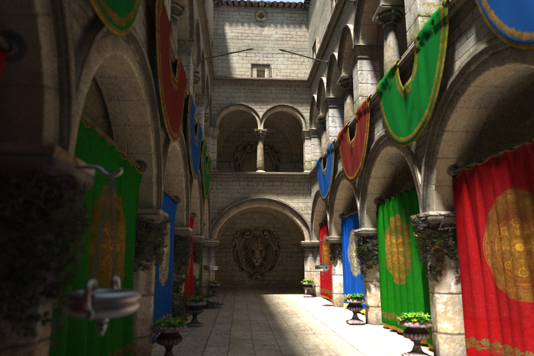
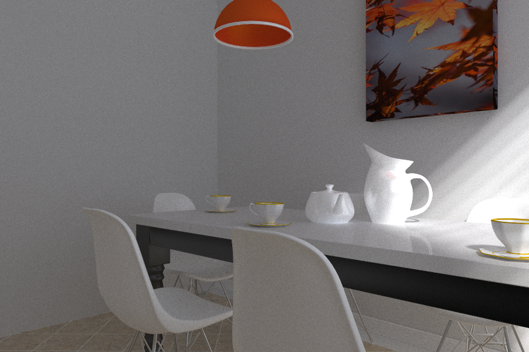

# FeiRays
Reusable Vulkan based ray-tracing code base.

The code is evolved from [VkRayTraceWeekend](https://github.com/fynv/VkRayTraceWeekend).

Here, I'm trying to make it more extendable and reusable, so I can have more fun with it.

Now playing with [McGuire Computer Graphics Archive](https://casual-effects.com/data/)



The "sponza" model, 900x600x1000 rays, rendered in 11.2 seconds using RTX 2060 super.



The "breakfast_room" model, 900x600x1000 rays, rendered in 18.4 seconds using RTX 2060 super.

Using the newly added Python frontend, the above case can be rendered using the following Python script:

```python
import FeiRays

scene = FeiRays.Scene(900, 600)
scene.add_sunlight((1,1,1), 2, (4000,4000,4000))

transform = FeiRays.Transform()
scene.add_wavefront_object(transform, "breakfast_room", "breakfast_room.obj")
scene.set_camera((2.5,1.5,2.5), (0,1.5,0), (0,1,0), 45)
scene.trace(1000, 50)

img = scene.get_image()
img.save("breakfast_room.png")
```
(It is assumed that the model file "breakfast_room.obj" is located in the folder "breakfast_room".)

## Building and Running

Building the project is simple. 

The only dependency you need is CUDA SDK, which is used for initializing the random number generator(RNG) states for each pixel.

[Volk](https://github.com/zeux/volk.git) and [Vulkan-Headers](https://github.com/KhronosGroup/Vulkan-Headers.git) are included as submodules,
so it should be fine to build without Vulkan SDK, and the resulted executables should be adaptive to different Vulkan versions. 
But be sure to have the latest graphics driver installed, one that supports Vulkan. 

* Clone the repo and update the submodules
* Use CMake to generate a VS solution at FeiRays/build.
* Build and run the tests. 
* Shaders (spv) are expected at ../shaders relative to the starting folder.

## License 

I've decided to license this project under ['"Anti 996" License'](https://github.com/996icu/996.ICU/blob/master/LICENSE)

Basically, you can use the code any way you like unless you are working for a 996 company.

[](https://996.icu)


## Progress

In case someone is interested in the progress of the project, here is a list of what have been implemented so far.

### Random Number Generator for Shaders

RNGState.h, rand_state_init.cu, shaders/rand.shinc

For monte carlo path-tracing, it is quite essential to have a pseudo-random number generator ready everywhere.
For this purpose, we have a minimal set of XORWOW implementation of CURAND ported here. 
While the initialization of the RNG states are done by CUDA, the recursive random number generation can happen in shaders. 

While the quality of the random number generated from XORWOW is good, the method has the following downsides:

* Initialization is expensive: if the scene is simple, the initialization can cost most of the time
* The size of each RNG state is 6x32bit, which is quite big.

As a workaround, FeiRays allows user specifying a "batch_size" when creating a target image, so that we don't need a RNG state for every pixel.

This module can be replaced relatively easily, once we know there is a better method for this purpose.

### Vulkan Resource Management

Basic Vulkan resource classes are implemented in context.cpp.

* The Context
* Command Buffers
* Linear Buffers
* Textures and Cubemaps
* Acceleration Structures

### Geometries

There is abstract class called "Geometry". Each sub-class can have its own closest-hit shader and intersection shader (optional).

* ColoredUnitSphere: support a uniform color and different material types
* ColoredIndexedTriangleList: support a uniform color and different material types
* UnitSphereCheckerTex: procedure texture. diffuse only
* TexturedUnitSphere: 1 texture attached to 1 sphere. diffuse only
* TexturedTriangleList: support multiple textures. diffuse only
* WavefrontIndexedTriangleList: support multiple textures. support diffuse, specular, emissive material types. support alpha-map and bump-map.

### Light sources

There are 3 Kinds of light-sources

* Emissive material: including the sky-box
* Sphere light sources
* Sunlight: round lights at infinite distance 

### PathTracer

The class "PathTracer" maintains a list of the geometries and path-traces them.


### Next

Implement a bidirectional path-tracer.
